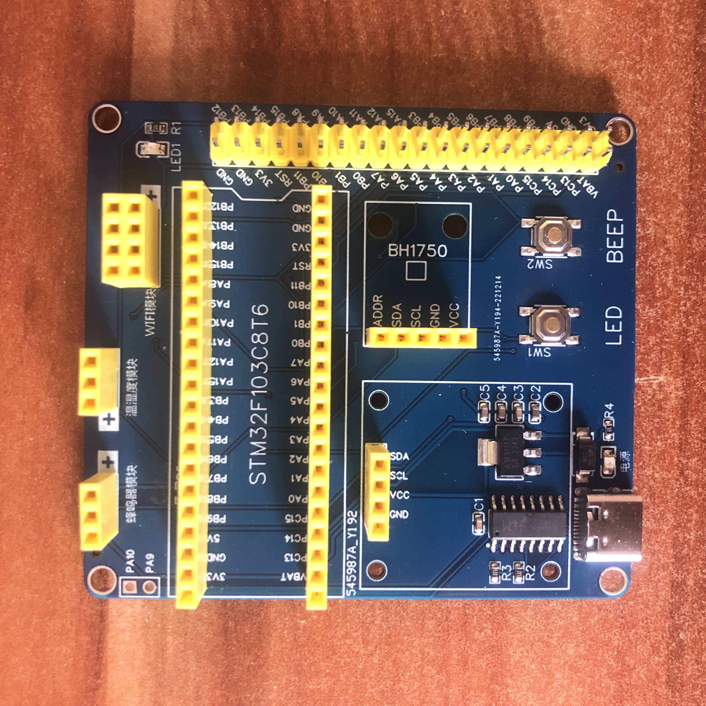

# 1.总体思路与硬件选型

## 整体结构


## 硬件选型

### 核心板

* STM32F103C8T6

### WIFI模块

* ESP8266-01s

### 传感器

* DHT11温湿度传感器

* BH1750光照传感器

### 其他

* LED

* 0.96寸OLED显示屏

* 4脚按键模块

* CH340C模块

* 有源蜂鸣器（低电平触发）

* 各类电阻与电容等

## 硬件采购记录

|         元件名          | 需求量 |
| :---------------------: | :----: |
|         1x2排针         |   1    |
|        2x20排针         |   1    |
|         2x4底座         |   1    |
|        10kΩ电阻         |   1    |
|        5.1kΩ电阻        |   2    |
|        510Ω电阻         |   2    |
|           LED           |   2    |
|        TypeC底座        |   1    |
|        100nF电容        |   3    |
|        10μF电容         |   2    |
|    DHT11温湿度传感器    |   1    |
|       CH340C模块        |   1    |
|    AMS1117-3.3稳压器    |   1    |
| STM32F103C8T6最小系统板 |   1    |
|       有源蜂鸣器        |   1    |
|    0.96寸OLED显示屏     |   1    |
|   BH1750光照度传感器    |   1    |
|      肖特基二极管       |   1    |
|        按键模块         |   2    |

# 2.PCB

 

## 硬件外观

 

 

# 3.外设驱动配置

## 温湿度/光照传感器的采集实现

### DHT11温湿度传感器

* 主要头文件：`dht11.h`

* 主要源文件：`dht11.c`

* 主要函数：

  ```c
  void DH11_Init(void);
  u8 DHT11_Read_Data(u8 *humiH, u8 *humiL, u8 *tempH, u8 *tempL);
  ```

### BH1750光照度传感器

- 主要头文件：`bh1750.h`

- 主要源文件：`bh1750.c`

- 主要函数：

  ```c
  void BH1750_Init(void);
  float Light_Intensity(void);
  ```

## OLED数据显示

**数据的显示在定时器中断中进行(TIM2)**

- 主要头文件：`timer.h, oled.h, stdio.h`

- 主要源文件：`timer.c, oled.c`

- 主要函数：

  ```c
  void TIMx_Int_Init(u16 arr, u16 psc); // 计时器初始化
  void TIMx_IRQHandler(void); // TIMx中断处理
  void OLED_Init(void); // OLED初始化
  void OLED_ColorTurn(bool flag); // 是否反色显示
  void OLED_DisplayTurn(bool flag); // 是否翻转显示
  void OLED_Clear(void); // 清屏
  int sprintf(char *buffer, const char *format, ...); // C标准库函数
  void OLED_ShowString(unsigned char x, unsigned char y, unsigned char *buffer, unsigned char size); // 显示（非中文）字符
  void OLED_Refresh(void); // 刷新
  ```

## 蜂鸣器报警的自动化实现

**蜂鸣器的自动控制依然在定时器中断中进行(TIM3)**

- 主要头文件：`beep.h`

- 主要源文件：`beep.c`

- 主要函数/方法：

  ```c
  void TIMx_Int_Init(u16 arr, u16 psc); // 计时器初始化
  void TIMx_IRQHandler(void); // TIMx中断
  BEEP = !BEEP; // 蜂鸣器响
  if(humidityH < 80 && temperatureH < 32 && Light < 10000) alarmFlag = 0;
  else alarmFlag = 1; // 报警逻辑
  ```

## 蜂鸣器报警的手动控制与手动/自动控制权的协调

**蜂鸣器的手动控制采用外部中断的按键(EXTI1)**

- 主要头文件：`key.h`

- 主要源文件：`key.c`

- 主要函数：

  ```c
  void NVIC_PriorityGroupConfig(u8 NVIC_PriorityGroup_x); // 设置中断优先级分组
  void EXITX_Init(); // 外部中断初始化
  void TIMx_IRQHandler(void); // TIMx中断处理
  void KEY_Init(); // 按键初始化
  ```

# 4.设备端上行数据到MQTT服务器

> **参考:**
>
> [OneNET - 中国移动物联网开放平台](https://gitee.com/link?target=https%3A%2F%2Fopen.iot.10086.cn%2F)
>
> [OneNET开发板资料](https://gitee.com/link?target=https%3A%2F%2Fopen.iot.10086.cn%2Fbbs%2Fthread-863-1-1.html)
>
> [OneNET开发板MQTT接入实践](https://gitee.com/link?target=https%3A%2F%2Fwww.ixigua.com%2F6881093780322124295%3Fwid_try%3D1)

## MQTT协议

### 主要特性

- 使用发布/订阅消息模式，提供一对多的消息发布，解除应用程序耦合。这一点很类似于XMPP，但是MQTT的信息冗余远小于XMPP，因为XMPP使用XML格式文本来传递数据。

- 对负载内容屏蔽的消息传输。

- 使用TCP/IP提供网络连接。主流的MQTT是基于TCP连接进行数据推送的，但是同样有基于UDP的版本，叫做MQTT-SN。这两种版本由于基于不同的连接方式，优缺点自然也就各有不同了。

- 有三种消息发布服务质量：

  **"至多一次"（QoS0）**，消息发布完全依赖底层TCP/IP网络。会发生消息丢失或重复。这一级别可用于如下情况，环境传感器数据，丢失一次读记录无所谓，因为不久后还会有第二次发送。这一种方式主要普通APP的推送，倘若你的智能设备在消息推送时未联网，推送过去没收到，再次联网也就收不到了。

  **"至少一次"（QoS1）**，确保消息到达，但消息重复可能会发生。

  **"只有一次"（QoS2）**，确保消息到达一次。在一些要求比较严格的计费系统中，可以使用此级别。在计费系统中，消息重复或丢失会导致不正确的结果。这种最高质量的消息发布服务还可以用于即时通讯类的APP的推送，确保用户收到且只会收到一次。

- 小型传输，开销很小（固定长度的头部是2字节），协议交换最小化，以降低网络流量。非常适合物联网领域，传感器与服务器的通信，信息的收集，要知道嵌入式设备的运算能力和带宽都相对薄弱，使用这种协议来传递消息再适合不过了。

- 使用Last Will和Testament特性通知有关各方客户端异常中断的机制。

  Last Will：即遗言机制，用于通知同一主题下的其他设备发送遗言的设备已经断开了连接。

  Testament：遗嘱机制，功能类似于Last Will。

### MQTT协议实现方式

实现MQTT协议需要客户端和服务器端通讯完成，在通讯过程中，MQTT协议中有三种身份：**发布者（Publish）**、**代理（Broker）**、**订阅者（Subscribe）**。其中，消息的发布者和订阅者都是客户端，消息代理是服务器，消息发布者可以同时是订阅者。

MQTT传输的消息分为：**主题(Topic)** 和 **负载(Payload)** 两部分：

- Topic：可以理解为消息的类型，订阅者订阅（Subscribe）后，就会收到该主题的消息内容（Payload）；
- Payload：可以理解为消息的内容，是指订阅者具体要使用的内容。

### 网络传输与应用消息

MQTT会构建底层网络传输：它将建立客户端到服务器的连接，提供两者之间的一个有序的、无损的、基于字节流的双向传输。

当应用数据通过MQTT网络发送时，MQTT会把与之相关的服务质量（QoS）和主题名（Topic）相关连。

### MQTT客户端

一个使用MQTT协议的应用程序或者设备，它总是建立到服务器的网络连接。客户端可以：

- 发布其他客户端可能会订阅的信息；
- 订阅其它客户端发布的消息；
- 退订或删除应用程序的消息；
- 断开与服务器连接。

### MQTT服务器

MQTT服务器称为"消息代理"（Broker），可以是一个应用程序或一台设备。它是位于消息发布者和订阅者之间，它可以：

- 接受来自客户的网络连接；
- 接受客户发布的应用信息；
- 处理来自客户端的订阅和退订请求；
- 向订阅的客户转发应用程序消息。

### MQTT协议中的订阅、主题、会话

#### 订阅（Subscription）

订阅包含主题筛选器（Topic Filter）和最大服务质量（QoS）。订阅会与一个会话（Session）关联。一个会话可以包含多个订阅。每一个会话中的每个订阅都有一个不同的主题筛选器。

#### 会话（Session）

每个客户端与服务器建立连接后就是一个会话，客户端和服务器之间有状态交互。会话存在于一个网络之间，也可能在客户端和服务器之间跨越多个连续的网络连接。

#### 主题名（Topic Name）

连接到一个应用程序消息的标签，该标签与服务器的订阅相匹配。服务器会将消息发送给订阅所匹配标签的每个客户端。

#### 主题筛选器（Topic Filter）

一个对主题名通配符筛选器，在订阅表达式中使用，表示订阅所匹配到的多个主题。

#### 负载（Payload）

消息订阅者所具体接收的内容。

## JSON

> JSON的全称是"**JavaScript Object Notation**"，意思是JavaScript对象表示法，它是一种基于文本，独立于语言的轻量级数据交换格式。XML也是一种数据交换格式，为什么没有选择XML呢？因为XML虽然可以作为跨平台的数据交换格式，但是JavaScript中处理XML非常不方便，同时XML标记比数据多，增加了交换产生的流量，而JSON没有附加的任何标记，在JS中可作为对象处理，所以我们更倾向于选择JSON来交换数据。

### JSON的两种结构

#### 对象

对象结构以"{"括号开始，"}"括号结束。中间部分由0或多个以逗号分隔的"key(关键字)/value(值)"对构成，关键字和值之间以冒号分隔，语法结构如下。

```json
{
    key1:value1,
    key2:value2,
    ...
}
```

#### 数组

数组结构以”[”开始，”]”结束。中间由0或多个以”，”分隔的值列表组成，语法结构如下。

```json
[
    {
        key1:value1,
        key2:value2,
        ...
    },
    {
         key3:value3,
         key4:value4,
        ...
    },
    ...
]
```

## 实例代码

- 主要源文件：`esp8266.c, MqttKit.c, onenet.c, usart.c`

- 主要函数：

  ```c
  bool UsartPrintf(USART_DEBUG, char *str);
  bool ESP8266_SendCmd(char *cmd, char *res);
  bool MQTT_Subscribe(char *subscribe);
  bool MQTT_Publish(char *topic, char *str);
  ```

# 5.设备端接收MQTT服务器命令

> ### 参考:
>
> [cJSON](https://gitee.com/link?target=https%3A%2F%2Fgithub.com%2FDaveGamble%2FcJSON)

以下是STM32设备端接收服务器端MQTT命令的整个过程的概述：

## 1.MQTT协议连接服务器

STM32设备需要使用MQTT协议连接到服务器。这个过程需要指定服务器的地址和端口号，而为了后续连接微信小程序下发指令，所以此处的服务器端口必须支持SSL身份验证，也就是8883端口或8084端口。

## 2.订阅主题

在成功连接到服务器后，STM32设备需要订阅一个或多个主题。这些主题将是服务器向设备发送消息的通道。订阅主题的过程需要使用MQTT协议中的订阅消息。

本项目中订阅的主题是/mysmarthome/sub,此主题用来下发命令至设备端

## 3.等待服务器命令

一旦订阅了主题，STM32设备就可以等待服务器发送命令。当服务器向订阅的主题发布消息时，STM32设备将立即收到该消息。

## 4.解析命令

一旦收到服务器的命令，STM32设备需要解析该命令以确定应该采取的操作。这通常涉及到解析JSON格式的数据, 本项目使用cJSON来解析JSON数据

## 5.执行操作

最后，STM32设备需要执行操作，这可能涉及控制外部设备、读取传感器数据、发送数据到服务器等操作。

总的来说，STM32设备端接收服务器端MQTT命令的整个过程可以概括为：连接服务器，订阅主题，等待服务器命令，解析命令，执行操作。

- 主要头文件：`cJSON.h`

- 主要源文件：`cJSON.c`

- 主要函数：

  ```c
  #define CJSON_PUBLIC(type) type
  CJSON_PUBLIC(cJSON *) cJSON_Parse(const char *value);
  CJSON_PUBLIC(void) cJSON_Delete(cJSON *item);
  uint8 MQTT_UnpacketRecv(unsigned char *cmd);
  uint8 MQTT_UnpacketCmd(uint8 *rev_data, int8 **cmdid, int8 **req, uint16 *req_len);
  ```

# 6.小程序端开发

>  参考:
>
> [微信小程序](https://gitee.com/link?target=https%3A%2F%2Fmp.weixin.qq.com%2Fcgi-bin%2Fwx)
>
> [微信开发者工具](https://gitee.com/link?target=https%3A%2F%2Fdevelopers.weixin.qq.com%2Fminiprogram%2Fdev%2Fdevtools%2Fdownload.html)
>
> [Node.js](https://gitee.com/link?target=http%3A%2F%2Fnodejs.cn%2F)
>
> [Vue.js](https://gitee.com/link?target=https%3A%2F%2Fcn.vuejs.org%2F)
>
> [mpvue.com](https://gitee.com/link?target=http%3A%2F%2Fmpvue.com%2F)

## 效果展示


 

## 功能简述

* 接收设备端采集到的数据, 通过MQTT协议接收设备发送的JSON数据包, 并将其数据展示到微信小程序端
* 下发命令控制设备, 通过MQTT协议发送JSON数据包, 其中含有操作设备的数据, 设备接收数据并进行相应操作
* 显示设备端所在地的外部气温, 以方便控制者进行参考
* 进行用户身份核验, 防止无操作权限者对设备端进行操作

由于小程序端代码冗长, 且小程序端开发的代码并不是本次项目的重点, 所以不展开说明小程序端代码, 如感兴趣, 可以自行参考Github中的具体代码实现, 代码中已对大部分功能进行了注释说明


